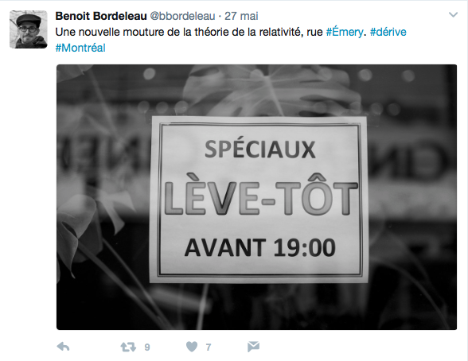

#### _Éditorialisation de l'espace_
 
### Les structures spatiales de l'éditorialisation
Enrico Agostini-Marchese
 
 
_Université de Montréal_ - _CRC sur les écritures numériques_ 
 
 
« Écritures numériques et éditorialisation 2016/2017»
 
 
01 juin 2017

%%%%%%%%%%%%%%%%%%%%%%%%%%%%%%%%%%%%%%%%%%%%%
<!-- .slide: data-background-image="img/boussole.jpg" -->
<!-- .element: class="givemeabackground" -->

Comment penser l’espace à l’ère du numérique ?

%%%%%%%%%%%%%%%%%%%%%%%%%%%%%%%%%%%%%%%%%%%%%
<!-- .slide: data-background-image="img/atlas.jpg" -->
<!-- .element: class="givemeabackground" -->

Henri Lefebvre, _La production de l'espace_, 1974, p. 49.
 
 
La sphère de l’imagination et de l’imaginaire produit un
 <i>« [e]space dominé, donc subi »</i>

§§§§§§§§§§§§§§§§§§§§§§§§§§§§§§§§§§§§§§§§§§§§§
<!-- .slide: data-background-image="img/barrage.jpg" -->
<!-- .element: class="givemeabackground" -->

Lefebvre : l'espace n'est pas un concept vide ou abstrait (mathématique, philosophie), mais partie intégrante d'un processus complexe de production.
 
 
<i>« Trialectique spatiale »</i>
 
 
Edward W. Soja, _Thirdspace: Journeys to Los Angeles and Other Real-and-Imagined Places_, 1996.

§§§§§§§§§§§§§§§§§§§§§§§§§§§§§§§§§§§§§§§§§§§§§
<!-- .slide: data-background-image="img/market.jpg" -->
<!-- .element: class="givemeabackground" -->

### Pratique spatiale

<i> « [q]ui englobe production et reproduction, lieux spécifiés et ensembles spatiaux propres à chaque formation sociale, qui assure la continuité dans une relative cohésion » </i>
 
 
H. Lefebvre, _La production de l'espace_, p. 42.

§§§§§§§§§§§§§§§§§§§§§§§§§§§§§§§§§§§§§§§§§§§§§
<!-- .slide: data-background-image="img/archi.jpg" -->
<!-- .element: class="givemeabackground" -->

### Représentations de l'espace

<i>« ... liées aux rapports de production, à l'“ordre” qu'ils imposent et par là, à des connaissances, à des signes, à des codes, à des relations “frontales” »</i>
 
 
H. Lefebvre, _La production de l'espace_, p. 43.

§§§§§§§§§§§§§§§§§§§§§§§§§§§§§§§§§§§§§§§§§§§§§
<!-- .slide: data-background-image="img/landart.png" -->
<!-- .element: class="givemeabackground" -->

### Espaces de représentation

<i> « [p]résentant (avec ou sans codage) des symbolismes complexes, liés au côté clandestin et souterrain de la vie sociale, mais aussi à l'art, qui pourrait éventuellement se définir non pas comme code de l'espace, mais comme code des espaces de représentations » </i>
 
 

H. Lefevbre, _La production de l'espace_, p. 43.

§§§§§§§§§§§§§§§§§§§§§§§§§§§§§§§§§§§§§§§§§§§§§
<!-- .slide: data-background-image="img/richter.jpg" -->
<!-- .element: class="givemeabackground" -->

### Espaces de représentation

<small>
<i> « [...] _les espaces de représentation_, c'est-à-dire l'espace vécu à travers les images et symboles qui l'accompagnent, donc espace des “habitants” et des “usagers”, mais aussi de certains artistes et peut-être de ceux qui _décrivent_ et croient seulement décrire : les écrivains, les philosophes. __C'est l'espace dominé, donc subi__, que tente de modifier et d'approprier l'imagination. Il recouvre l'espace physique en utilisant symboliquement ses objets »</i>
</small>
 
 
H. Lefevbre, _La production de l'espace_, p. 49.

%%%%%%%%%%%%%%%%%%%%%%%%%%%%%%%%%%%%%%%%%%%%%
<!-- .slide: data-background-image="img/edito.png" -->
<!-- .element: class="givemeabackground" -->

### Éditorialisation

 
<i>« […] l’ensemble des dynamiques qui produisent et structurent l’espace numérique. Ces dynamiques sont les interactions des actions individuelles et collectives avec un environnement numérique particulier »</i>
 
 
Marcello Vitali-Rosati, « Qu'est-ce que l'éditorialisation ? », <i>Sens Public</i>, 2016.

§§§§§§§§§§§§§§§§§§§§§§§§§§§§§§§§§§§§§§§§§§§§§
<!-- .slide: data-background-image="img/nomos.jpg" -->
<!-- .element: class="givemeabackground" -->

### _Nomos_

Carl Schmitt _Le_ nomos _de la terre_ (1950) et _Terre et mer_ (1942).
 
 
<small><i>« Tout ordre fondamental est un ordre spatial. Parler de la constitution d’un pays ou d’un continent, c’est parler de son ordre fondamental, de son __nomos__. Or, l’ordre fondamental, le vrai, l’authentique, repose essentiellement sur certaines limites spatiales, il suppose une délimitation, une dimension, une certaine répartition de la terre. L’acte inaugural de toute grande époque est une appropriation territoriale »</small></i>

§§§§§§§§§§§§§§§§§§§§§§§§§§§§§§§§§§§§§§§§§§§§§
<!-- .slide: data-background-image="img/nomos.jpg" -->
<!-- .element: class="givemeabackground" -->

### Espace et nomos

<ul>
<li>Milieu</li>
<li>Technique/technologie</li>
<li>Instances de l’autorité</li>
<li>Le symbolique et l’imaginaire</li>
</ul>

§§§§§§§§§§§§§§§§§§§§§§§§§§§§§§§§§§§§§§§§§§§§§
<!-- .slide: data-background-image="img/milieu.jpg" -->

#### Milieu

§§§§§§§§§§§§§§§§§§§§§§§§§§§§§§§§§§§§§§§§§§§§§
<!-- .slide: data-background-image="img/technique.jpg" -->
<!-- .element: class="givemeabackground" -->

#### Technique et technologie

§§§§§§§§§§§§§§§§§§§§§§§§§§§§§§§§§§§§§§§§§§§§§
<!-- .slide: data-background-image="img/paturage.jpg" -->
<!-- .element: class="givemeabackground" -->

#### Instances d'autorité

§§§§§§§§§§§§§§§§§§§§§§§§§§§§§§§§§§§§§§§§§§§§§
<!-- .slide: data-background-image="img/dante.jpg" -->
<!-- .element: class="givemeabackground" -->

#### Imaginaire et symbolique

%%%%%%%%%%%%%%%%%%%%%%%%%%%%%%%%%%%%%%%%%%%%%

<small>

https://web.archive.org/web/20170517002227/https://victoriawelby.ca/

https://web.archive.org/web/20160111043219/http://victoriawelby.ca/

https://web.archive.org/web/20160311134549/http://victoriawelby.ca/derives/fiche

</small>

%%%%%%%%%%%%%%%%%%%%%%%%%%%%%%%%%%%%%%%%%%%%%

### Dérives

§§§§§§§§§§§§§§§§§§§§§§§§§§§§§§§§§§§§§§§§§§§§§

#### Règles pour Twitter et Instagram

<ul>
<li>#dérive</li>
<li>#nomDeLieuQuelconque</li>
</ul>

 

https://storify.com/enagmar88/derives/preview

§§§§§§§§§§§§§§§§§§§§§§§§§§§§§§§§§§§§§§§§§§§§§

> « Dérive = réalité augmentée sans technologie. Faut ouvrir les yeux, les oreilles, les narines, la bouche, tendre les mains. Marcher dans la ville. Ou ailleurs. Ralentir. Flâner. Observer. Se laisser imprégner. Errer. Et, surtout, avoir du plaisir à le faire. Et puis écrire si le cœur nous en dit ».

Pharaon Parka, « La #dérive expliquée à la génération Y »
